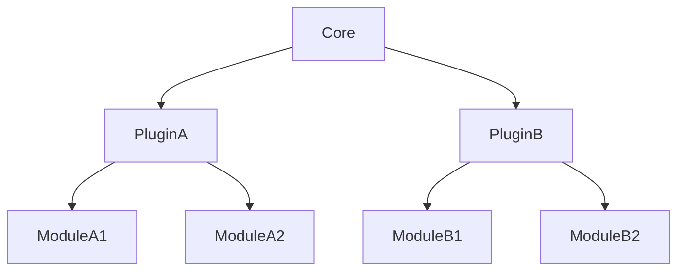

# Extensions in Game Engine

Extensions allow for feature expansion within the core game engine. All extensions should be self-contained and standalone, ensuring modularity and maintainability.

## Types of Extensions

There are **two main types of extensions**: **Plugins** and **Modules**.

### 1. Plugin

A **Plugin** is the primary type of extension in the game engine. It extends the functionality of the core engine, interacting directly with the core but without relying on any modules or other plugins.

-   Plugins are initialized **before modules**.
-   Plugins can rely **only** on core game engine features.

### 2. Module

A **Module** is a secondary type of extension that builds on top of a plugin. Modules are designed to further extend or enhance the functionality provided by a plugin.

-   Modules can rely on both **plugin** and **core** resources.
-   **Dependency Flow**: Modules depend on plugins, but plugins cannot depend on modules.

### Key Dependency Rules

-   **Plugins** depend only on the core.
-   **Modules** depend on both the core and the plugin they extend.
-   **No Reverse Dependencies**: Plugins must not depend on modules, and the core must not depend on either.

## Initialization Flow

1. **Plugins are initialized first**: This ensures all core features are properly extended.
2. **Modules are initialized after plugins**: Modules can then safely use any resources or functionality provided by their corresponding plugins.

### Example: Relationship Graph

